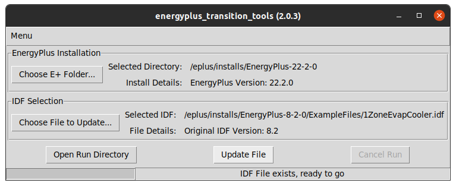

Welcome to EnergyPlusTransitionTools documentation!
===================================================

The purpose of this library is to enable EnergyPlus users to transition up their existing input files to the latest version of EnergyPlus.
This program itself is EnergyPlus-version-agnostic, and currently will transition input files up to the latest version available for the specified EnergyPlus install.

--------------------------
Packaging and Installation
--------------------------

The program is built and posted to PyPi: https://pypi.org/project/energyplus-transition-tools/

-------------------
Program Main Window
-------------------

Launching the program reveals the following main window:

This main window reveals a lot of information.

* The window title bar shows the program version

* The menu dropdown allows the user to specify a language, toggle whether to keep intermediate files, view the About dialog, or exit the program.

* The first section of the main form is about specifying an EnergyPlus install directory; upon selecting a folder, the label will include extra information

* The second section of the main form is about specifying an input file to transition; upon selecting a file, the label will include extra information about the file.  If you specify a .lst file, it should contain a list of file paths to transition.

* There are then a set of buttons that execute program actions, including opening the run directory which will contain output files, opening the input file directory, and running/cancelling the transition process

* The status bar shows progress and updates during the program operation, including running each transition and when the whole transition is complete or if there was a failure

----------------
Typical Workflow
----------------

Consider a new version of EnergyPlus is released, version 23.1.  A user has built example files previously that are based on EnergyPlus 8.1.
Instead of manually updating each input file, they will:

* Open this IDFVersionUpdater utility, and point the install directory to the new version of EnergyPlus

* Use the ``Choose File`` button to locate an idf from the previous version (8.1 in this example) and select it, verifying that the version label on the form properly reflects the expected version

* Click the ``Update`` button to initiate the transition up to the latest version.  For this example, it would transition from 8.1 to 23.1 without any extra steps.  If the original input file was an older version, multiple transition steps would be performed to get to the latest version

* The user would then click the ``Open Directory`` button to open a window to the input file location to be run with the latest version (23.1 in this example)

-------------------------
Source Code Documentation
-------------------------

Documentation of the source code, pretty much only important for the developers, is available for the following modules.

.. toctree::
   :maxdepth: 2

   energyplus_path
   international
   transition_binary
   transition_run_thread
   gui

Indices and tables
==================

* :ref:`genindex`
* :ref:`modindex`
* :ref:`search`

